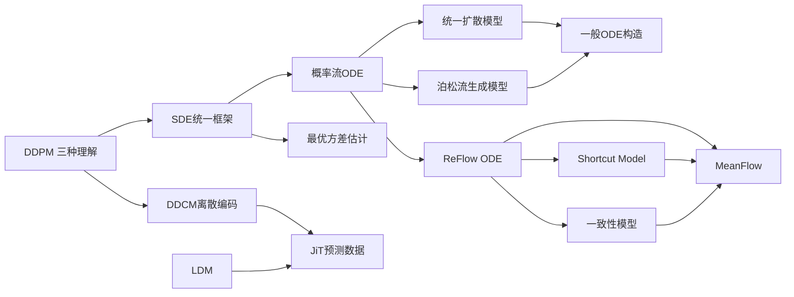

# 生成扩散模型漫谈（Part 1: 1–15 + Part 2: 16–31）

本系列是苏剑林博客的核心支柱系列，从2022年6月到2025年11月用31篇文章构建了扩散模型的完整理论大厦。

## 系列结构

四大主题群（Part 1）：

### 基础篇（1–4）：DDPM的四种理解
1. **拆楼建楼**（[[spaces-9119-DDPM-拆楼-建楼|9119]]）：仅用正态分布叠加性推导DDPM
2. **自回归式VAE**（[[spaces-9152-DDPM-自回归式VAE|9152]]）：最小化联合分布KL散度
3. **贝叶斯+去噪**（[[spaces-9164-DDPM-贝叶斯-去噪|9164]]）：计算$p(x_{t-1}|x_t,x_0)$再近似
4. **高观点DDPM**（[[spaces-9181-DDIM-高观点DDPM|9181]]）：待定系数法释放$p(x_t|x_{t-1})$依赖

### 框架篇（5–6）：SDE/ODE统一
5. **SDE篇**（[[spaces-9209-扩散模型一般框架之SDE篇|9209]]）：前向SDE + 反向SDE + 反向工程
6. **ODE篇**（[[spaces-9228-一般框架之ODE篇|9228]]）：Fokker-Planck方程 → 概率流ODE → DDIM特例

### 深化与应用篇（7–9）：方差估计与条件控制
7-8. **最优方差估计**（[[spaces-9245-最优扩散方差估计上|9245]]、[[spaces-9246-最优扩散方差估计下|9246]]）：从标量到逐维，Analytic-DPM / NPR-DPM / SN-DPM
9. **条件生成**（[[spaces-9257-条件控制生成结果|9257]]）：Classifier-Guidance 和 Classifier-Free

### 统一与突破篇（10–15）：超越传统框架
10-11. **统一扩散模型**（[[spaces-9262-统一扩散模型理论篇|9262]]、[[spaces-9271-统一扩散模型应用篇|9271]]）：$\mathcal{F}_t(x_0,\varepsilon)$统一架构
12. **"硬刚"ODE**（[[spaces-9280-硬刚扩散ODE|9280]]）：雅可比行列式直接推导
13. **万有引力类比**（[[spaces-9305-从万有引力到扩散模型|9305]]）：PFGM泊松流生成模型
14-15. **一般ODE构造**（[[spaces-9370-构建ODE的一般步骤上|9370]]、[[spaces-9379-构建ODE的一般步骤中|9379]]）：无散度条件 → 格林函数 → 特征线法

### Part 2 主题群

**ODE构造完成与加速（16–17, 21）：**
16. **W距离与得分匹配**：扩散模型与Wasserstein距离的关联
17. **ReFlow**：构建ODE的一般步骤（下），引入ReFlow方法
21. **AMED**：中值定理加速ODE采样

**大图生成（22–23）：**
22. **信噪比与大图生成（上）**：SNR缩放问题
23. **信噪比与大图生成（下）**：Upsample Guidance免训练技巧

**蒸馏与单步生成（24, 27–28, 30）：**
24. **SiD深度蒸馏**：无真实数据单步蒸馏
27. **Shortcut Model**（[[spaces-10617-生成扩散模型漫谈-二十七-将步长作为条件输入|10617]]）：步长作为条件输入
28. **一致性模型**（[[spaces-10633-生成扩散模型漫谈-二十八-分步理解一致性模型|10633]]）：CT/CD逐步推导
30. **MeanFlow**（[[spaces-10958-生成扩散模型漫谈-三十-从瞬时速度到平均速度|10958]]）：从瞬时速度到平均速度

**架构与表示（29, 31）：**
29. **DDCM**（[[spaces-10711-生成扩散模型漫谈-二十九-用DDPM来离散编码|10711]]）：用DDPM做离散编码
31. **JiT**（[[spaces-11428-生成扩散模型漫谈-三十一-预测数据而非噪声|11428]]）：预测数据而非噪声

## 核心概念演进

## 关键命题

1. DDPM本质上不同于传统能量基扩散模型——它是一种"渐变模型"
2. 任意两个$\sigma_t^2 \leq g_t^2$的SDE共享相同的边缘分布——概率流ODE是$\sigma_t=0$的特例
3. 最优反向方差需要在$\sigma_t^2$基础上加上$\gamma_t^2\bar{\sigma}_t^2$以考虑$x_0$预测不确定性
4. UDM框架可以统一DDPM、DDIM、Cold Diffusion、MLM掩码生成和编码模型
5. PFGM通过$d+1$维技巧打破万有引力场的模式坍缩，摆脱高斯假设
6. 一般ODE构造有两个对偶路径：先选定$p_t(x)$再解ODE（格林函数法），或先设计轨迹再解连续方程（特征线法）
7. 单步生成的关键在于修改建模目标而非求解器——从瞬时速度切换到平均速度（MeanFlow）
8. 数据处于低维流形而噪声充满全空间——预测数据比预测噪声更易通过低秩瓶颈

## 阅读路径

### 快速入门路径
1 → 4（DDPM直觉 → DDIM加速）→ 9（条件生成）→ 10（获得统一视角）

### 理论深入路径
1 → 5 → 6 → 10 → 14 → 15（完整SDE→ODE→统一→一般构造链）

### 应用导向路径
1 → 4 → 7 → 8 → 9 → 11（关注采样加速、方差优化、条件控制和模型统一）

### 加速生成专题路径
17（ReFlow）→ 27（Shortcut）→ 28（CM）→ 30（MeanFlow）

### 架构设计专题路径
29（DDCM离散编码）→ 31（JiT预测数据）

## 跨系列连接

- **Transformer升级之路**：SDE/ODE形式化与RoPE长度外推共享数学工具（泰勒展开、待定系数法）
- **从动力学角度看优化算法**：SDE框架与优化器动力学共享随机微分方程语言
- **变分自编码器**：DDPM的VAE理解（第二篇）和编码模型（第十一篇）直接连接VAE系列
